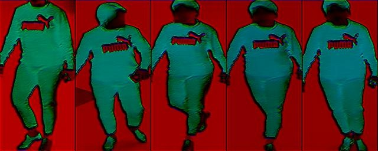

# naic2020_reid
naic 2020 AI+ 行人重识别项目


## 方案说明

### 建立验证集
使用 `./divided_dataset.py` 统计NAIC2020 reid的数据集，包括`train, test/gallery, test/query`中的green以及normal image 数量

normal image



green image


|  gallery_green_num   | gallery_normal_num  | query_green_num | query_normal_num | train_green_num | train_normal_num
|  ----  | ----  |  ----  | ----  |  ----  | ----  |
| 4149  | 	36317 | 1376  | 1524 | 39446  | 33378 |

其中，gallery_normal_num > train_normal_num, 因此不能从train 数据集中提取 normal image来建立 val 数据集。我们从测试集中提取 normal image 放入 val 的 gallery中充当干扰数据。具体code在`./mics/make_eval_dataset.py`。

### 具体策略

在 [naic2020示例程序](https://naic.pcl.ac.cn/frame/3) 的基础上, 我们从以下几个方面进行了测试
| 数据处理                              | 数据增强                | backbone         | loss                    | solver                        | attention        |
|-----------------------------------|---------------------|------------------|-------------------------|-------------------------------|------------------|
| 去除长尾数据                            | Mixup               | se\-resnet101\-a | CurricularFace          | SGD                           | selective kernel |
| naic mean std 替换imagenet mean std | random patch        | efficientnet     | TripletLoss with margin | centralized\_gradient\_SGD    | cbam             |
|                                   | big size 384 \* 192 | densenet         | AMSoftmax               | centralized\_gradient\_Ranger | non\_local       |
|                                   | AutoAugment         | inceptionv4      |                         |                               |                  |

其中比较多无效的尝试，下面我们仅列出有效的方法在A榜中的得分比较。（其中baseline 代表naic2020示例程序中的参数配置）

* baseline 0.468
* 加入niac 2019 数据集到train数据集，且去掉center loss 0.558
* 替换baseline中的数据增广策略为AutoAugment 0.598
* reranking parameter使用粒子群优化搜索超参数 0.611

最终，在B榜采用的方案为上述三种方法的综合： 即加入2019数据集 + AutoAugment + PSO reranking, 模型存放在`./ckpt/resnet101_ibn_a.pth`, 使用的参数配置文件`./configs/naic_round2_model_a.yml`。

### 复现
1.下载repo以及安装requirement
```
git clone https://github.com/ZhuangLii/naic2020_reid.git
pip install -r requirement.txt
```

2.下载模型

百度云盘

链接: https://pan.baidu.com/s/1vTDhroD66HeJ8AvBbyzwMw 提取码: 7p6y 

md5码：bc2ace16845f002660350daff8d6e517

将model放在 repo 的 `./ckpt` 文件夹下。

3.处理数据
```
cd /path/to/naic2020/train_dataset/images/
ls | awk '{print "mv "$1" 2020_"$1}' | sh
mv *.png /path/to/repo/data/train/images
cd /path/to/naic2019/train_dataset/images/
ls | awk '{print "mv "$1" 2019_"$1}' | sh
mv *.png /path/to/repo/data/train/images/
mv /path/to/naic2020/test/query/*.png /path/to/data/test/query_a/
mv /path/to/naic2020/test/gallery/*.png /path/to/data/test/gallery_a/
cd /path/to/repo/
mv ./mics/2019_2020_merge_label.txt ./data/train/label.txt
```
4. train + test 复现
```
sh run.sh
```
训练log位置`./log/train_log.txt`

测试log位置`./log/test_log.txt`

5. 仅 test 复现
```
sh run_sh_local.sh
```